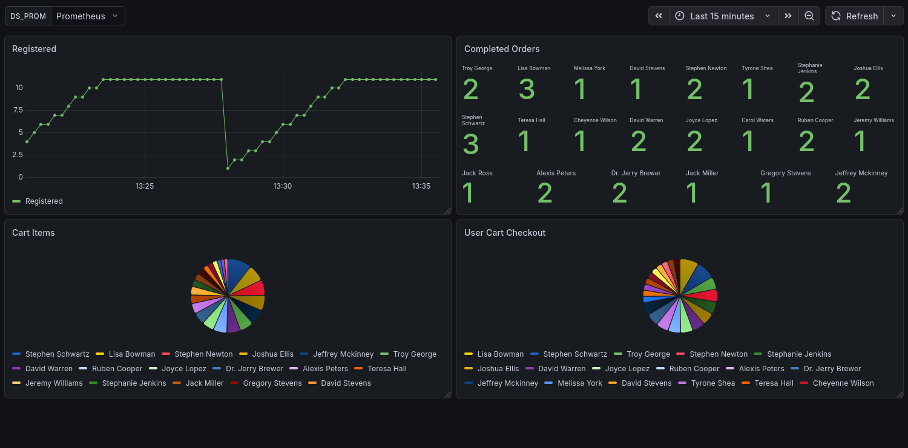
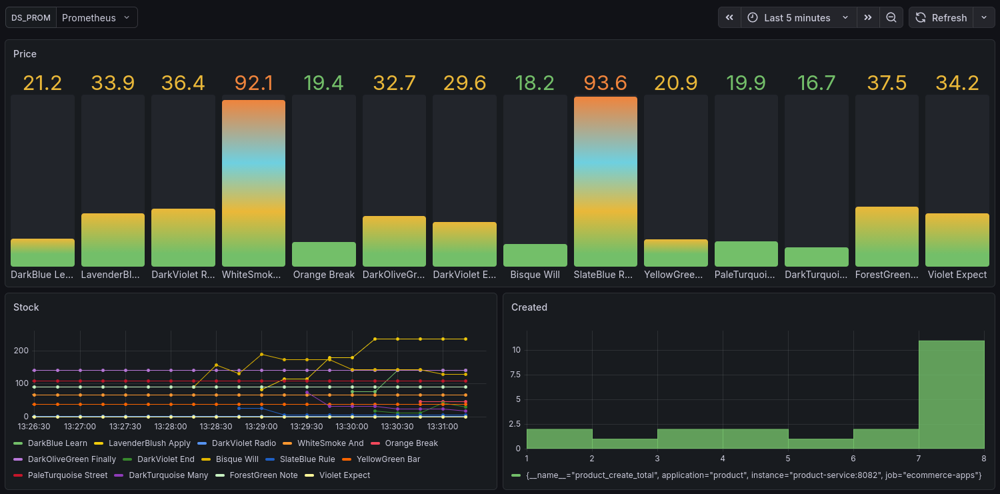
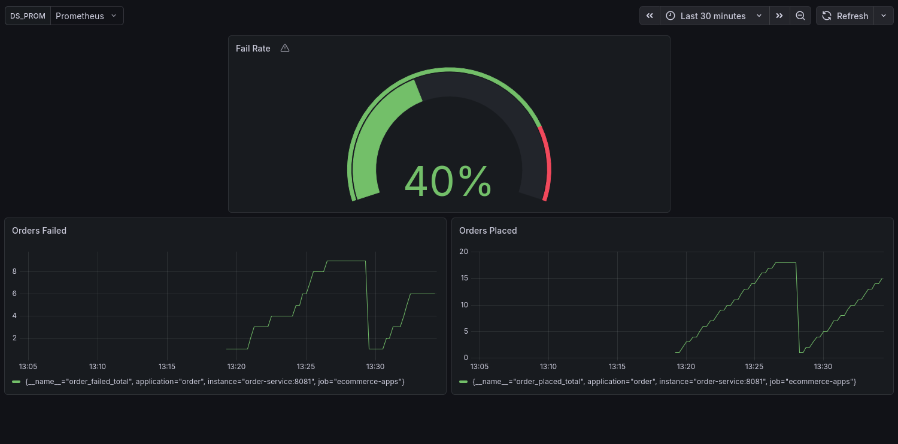

# Setup

```bash
chmod u+x ./gradlew

gradle build -x test

docker compose up -d
```

## Data

```bash
uv install
uv run main.py
```

# View Data

Visit [Grafana](http://localhost:3000). \
Username: admin \
Password: admin

And look at the dashboards, the Python script running in the background generates random users, products, orders and price updates.

## Preview

### User



### Product



### Order

